# Entity-Relationship Diagram

This document describes the data model for the RA Nutrition & Lifestyle App at the entity level. It shows **what** is stored and **how entities relate** — it intentionally omits scoring fields' meaning, rule-engine internals, and clinical interpretation.

> The diagrams below use [Mermaid](https://mermaid.js.org/) and render natively on GitHub.

---

## Logical Schemas

Tables are grouped into four logical PostgreSQL schemas, each with a single responsibility:

| Schema | Responsibility | Representative Tables |
|--------|----------------|------------------------|
| **core** | Identity, profile, and account lifecycle | `users`, `user_preferences`, `user_medications`, `authentication_sessions`, `account_deletion_requests` |
| **static** | Reference data that changes infrequently | `foods`, `meals`, `meal_items` |
| **tracking** | Time-series user activity | `food_logs`, `symptom_logs`, `lifestyle_logs` |
| **intelligence** | Derived data for recommendations & analytics | `recommendation_logs` |

---

## Full ER Diagram

```mermaid
erDiagram
  USERS ||--|| USER_PREFERENCES : "owns profile settings"
  USERS ||--o{ USER_MEDICATIONS : "tracks medications"
  USERS ||--o{ AUTHENTICATION_SESSIONS : "has auth sessions"
  USERS ||--o{ ACCOUNT_DELETION_REQUESTS : "can request deletion"

  USERS ||--o{ FOOD_LOGS : "creates food logs"
  USERS ||--o{ SYMPTOM_LOGS : "creates symptom logs"
  USERS ||--o{ LIFESTYLE_LOGS : "creates lifestyle logs"
  USERS ||--o{ RECOMMENDATION_LOGS : "receives recommendations"

  MEALS ||--o{ MEAL_ITEMS : "contains items"
  FOODS ||--o{ MEAL_ITEMS : "used in meal items"

  FOODS o|--o{ FOOD_LOGS : "logged as food"
  MEALS o|--o{ FOOD_LOGS : "logged as curated meal"

  MEALS o|--o{ RECOMMENDATION_LOGS : "recommended meal"
  FOODS o|--o{ RECOMMENDATION_LOGS : "replacement food"
  MEALS o|--o{ RECOMMENDATION_LOGS : "replacement meal"

  USERS {
    uuid id PK
    text email
    text full_name
    text password_hash
    text timezone
    boolean is_active
    timestamptz created_at
    timestamptz updated_at
    timestamptz last_login_at
  }

  USER_PREFERENCES {
    uuid id PK
    uuid user_id FK
    jsonb allergies_jsonb
    jsonb dietary_flags_jsonb
    jsonb disliked_foods_jsonb
    jsonb goal_flags_jsonb
    boolean onboarding_completed
    boolean disclaimer_accepted
    timestamptz disclaimer_accepted_at
    timestamptz created_at
    timestamptz updated_at
  }

  USER_MEDICATIONS {
    uuid id PK
    uuid user_id FK
    text medication_name
    text schedule_note
    boolean is_active
    timestamptz created_at
    timestamptz updated_at
  }

  AUTHENTICATION_SESSIONS {
    uuid id PK
    uuid user_id FK
    text refresh_token_hash
    timestamptz issued_at
    timestamptz expires_at
    timestamptz revoked_at
    timestamptz last_used_at
    text user_agent
    inet ip_address
    timestamptz created_at
  }

  ACCOUNT_DELETION_REQUESTS {
    uuid id PK
    uuid user_id FK
    text status
    text reason
    timestamptz requested_at
    timestamptz scheduled_for
    timestamptz processed_at
    timestamptz created_at
    timestamptz updated_at
  }

  FOODS {
    uuid id PK
    text external_source
    text external_id
    text name
    text brand_name
    text category
    numeric serving_size_g
    numeric calories
    numeric protein_g
    numeric carbs_g
    numeric fat_g
    numeric saturated_fat_g
    numeric fiber_g
    numeric sugar_g
    numeric sodium_mg
    numeric omega3_g
    numeric calcium_mg
    numeric vitamin_d_ug
    numeric anti_inflammatory_score
    jsonb dietary_tags_jsonb
    jsonb metadata_jsonb
  }

  MEALS {
    uuid id PK
    text name
    text meal_type
    integer prep_time_minutes
    numeric anti_inflammatory_score
    numeric protein_g
    numeric fiber_g
    numeric sugar_g
    numeric sodium_mg
    numeric calories
    boolean is_curated
    jsonb dietary_tags_jsonb
    jsonb reason_tags_jsonb
  }

  MEAL_ITEMS {
    uuid id PK
    uuid meal_id FK
    uuid food_id FK
    numeric quantity
    text unit
    numeric grams
    smallint sort_order
    timestamptz created_at
  }

  FOOD_LOGS {
    uuid id PK
    uuid user_id FK
    uuid food_id FK
    uuid meal_id FK
    text custom_food_name
    text meal_type
    numeric portion_g
    timestamptz logged_at
    timestamptz created_at
    timestamptz updated_at
  }

  SYMPTOM_LOGS {
    uuid id PK
    uuid user_id FK
    smallint pain_score
    smallint fatigue_score
    smallint stiffness_score
    smallint swelling_score
    text flare_level
    boolean escalation_triggered
    timestamptz logged_at
    timestamptz created_at
  }

  LIFESTYLE_LOGS {
    uuid id PK
    uuid user_id FK
    date log_date
    numeric sleep_hours
    integer steps
    integer water_ml
    smallint stress_level
    boolean medication_taken
    timestamptz created_at
    timestamptz updated_at
  }

  RECOMMENDATION_LOGS {
    uuid id PK
    uuid user_id FK
    uuid meal_id FK
    text recommended_for_meal_type
    jsonb recommendation_context_jsonb
    text explanation_text
    jsonb alternatives_jsonb
    jsonb rules_applied_jsonb
    timestamptz shown_at
    text feedback_status
    text feedback_reason
    uuid replacement_food_id FK
    uuid replacement_meal_id FK
    timestamptz created_at
    timestamptz updated_at
  }
```

---

## Relationship Notes

- **One user, one preference profile.** `users` ↔ `user_preferences` is strictly 1:1 — an empty preferences row is created at registration.
- **Sessions are append-only and revocable.** Each login creates an `authentication_sessions` row holding a *hash* of the refresh token. Token rotation revokes the old row, so reuse is detectable.
- **Meals are compositions of foods.** `meals` → `meal_items` → `foods` models a curated meal as an ordered list of portioned ingredients.
- **A food log is polymorphic.** A `food_logs` row may reference a single `food`, a curated `meal`, or carry only a `custom_food_name` (free-text) — the optional FKs (`o|--o{`) capture that all three are valid sources.
- **Recommendations are auditable.** `recommendation_logs` records what was shown, the rules applied, the user's feedback, and any replacement they chose — a full trail for transparency and (in V2/V3) feedback-driven tuning.

> Table-level constraints, indexes, and scoring semantics live in the migration files and are intentionally out of scope here.
