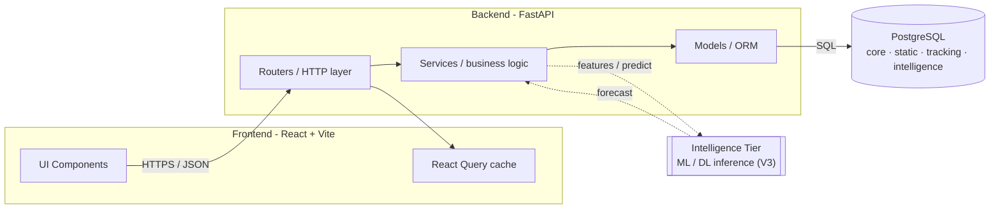
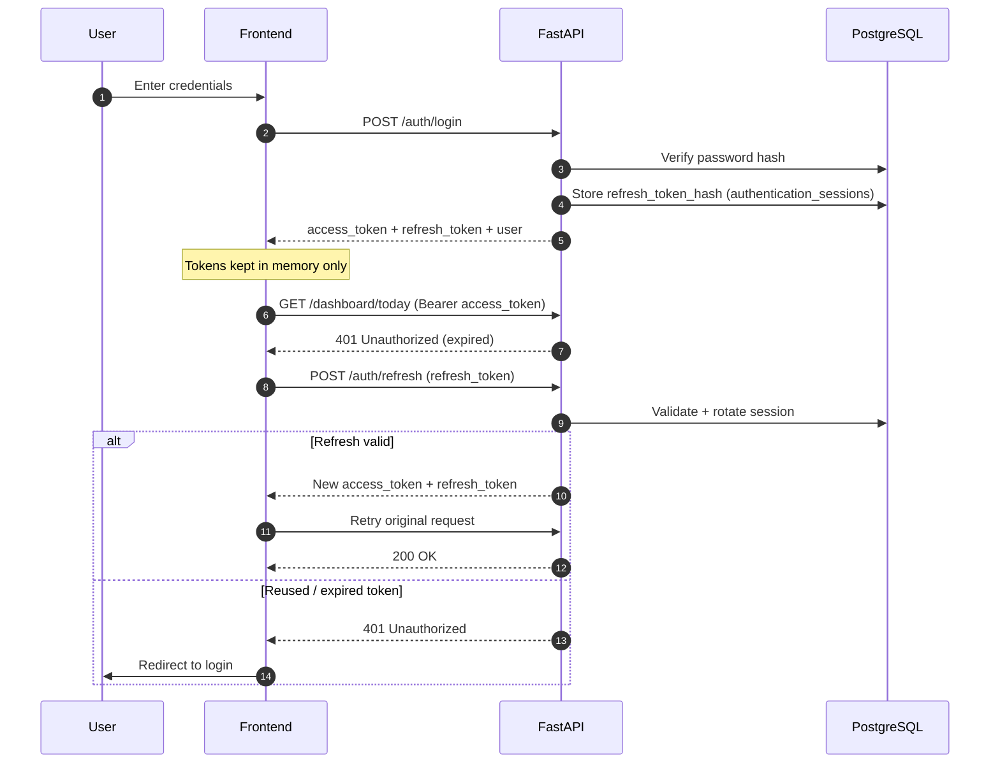
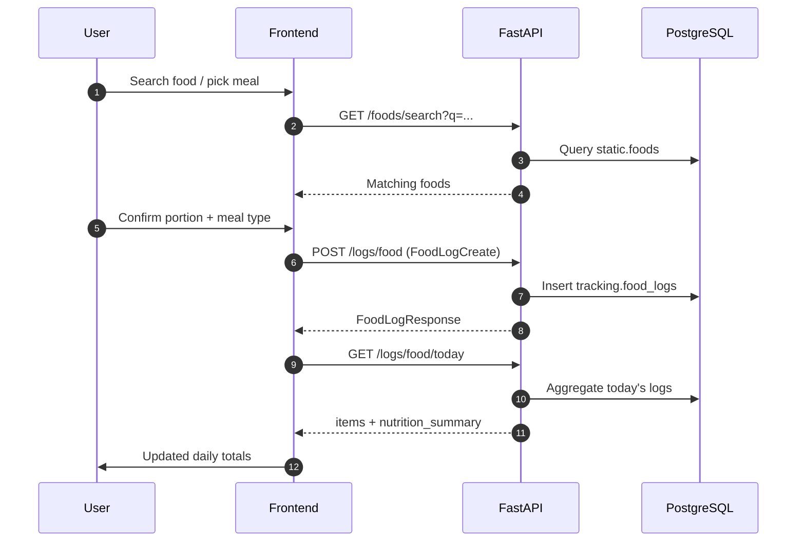
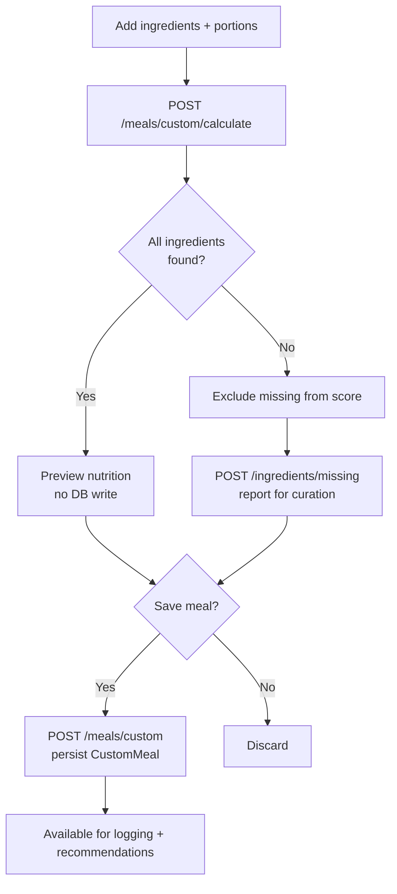
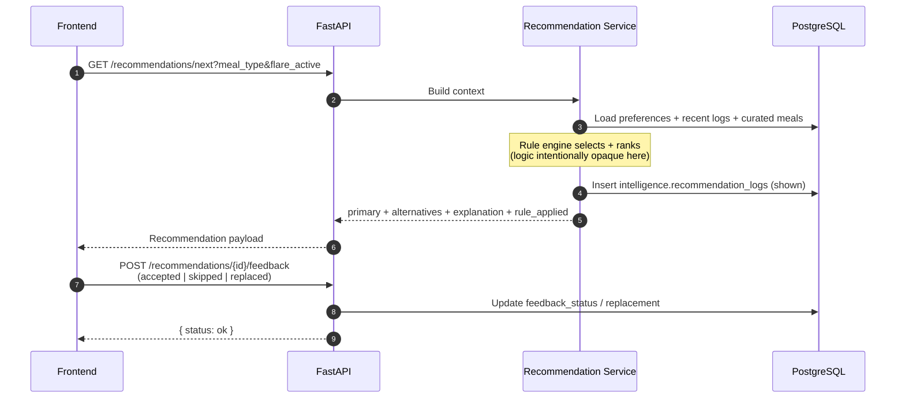
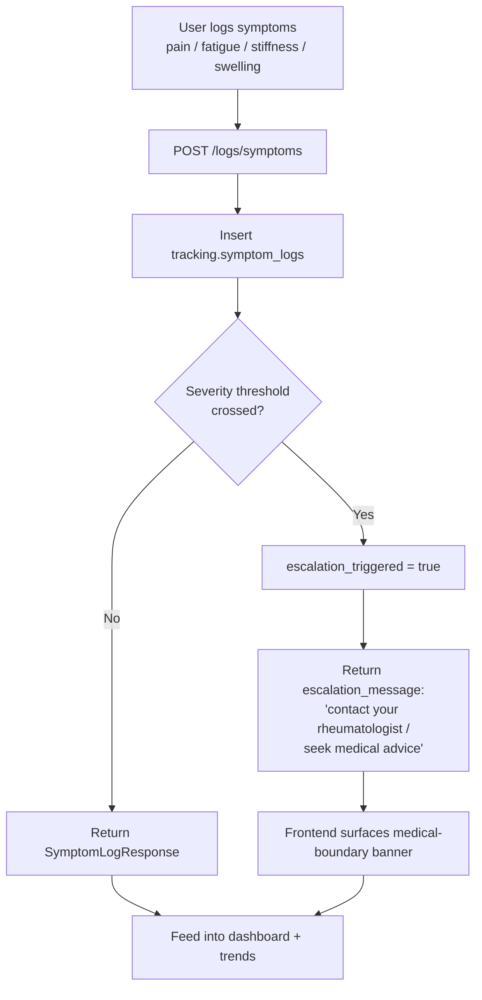
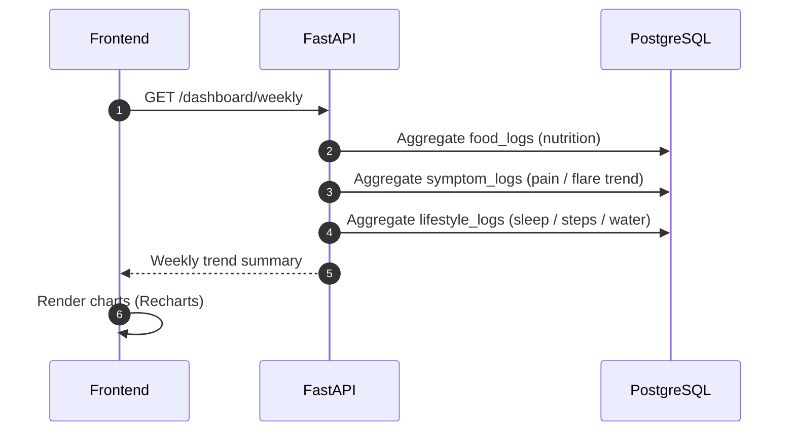
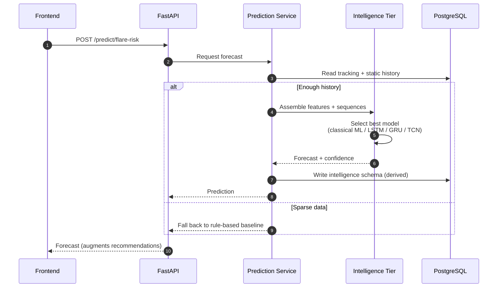

# Workflows

End-to-end walkthroughs of the core user journeys, expressed as [Mermaid](https://mermaid.js.org/) diagrams that render natively on GitHub. Each diagram describes the **flow of control and data** between the React client, the FastAPI backend, PostgreSQL, and (in V3) the intelligence tier.

> These describe *shape and sequence* only. Scoring math and rule-engine internals are intentionally omitted, and nothing here constitutes clinical logic. See the **Medical Disclaimer** in the [README](../README.md).

**Contents**

1. [System Overview](#1-system-overview)
2. [Authentication & Token Refresh](#2-authentication--token-refresh)
3. [Meal Logging](#3-meal-logging)
4. [Custom Meal Builder](#4-custom-meal-builder)
5. [Recommendation Flow](#5-recommendation-flow)
6. [Symptom Logging & Medical Escalation](#6-symptom-logging--medical-escalation)
7. [Weekly Analytics](#7-weekly-analytics)
8. [Prediction Flow (V3)](#8-prediction-flow-v3)

---

## 1. System Overview

How a request travels through the tiers. The frontend never touches the database directly — the backend is the single source of truth.

---

## 2. Authentication & Token Refresh

Access tokens are held in memory (never `localStorage`). On a `401`, the client transparently refreshes and retries. Refresh tokens are rotated, so a reused token is rejected.

---

## 3. Meal Logging

A logged item may be a library food, a curated meal, or free-text — all land in `food_logs` and immediately update the day's nutrition summary.

---

## 4. Custom Meal Builder

Users assemble a meal from ingredients. `calculate` previews nutrition with **no DB write**; saving persists it. Unknown ingredients are captured for later curation.

---

## 5. Recommendation Flow

The backend assembles context (preferences, recent logs, flare state), runs the transparent rule engine, returns a primary pick plus alternatives **with an explanation**, and records what was shown for feedback.

---

## 6. Symptom Logging & Medical Escalation

The hard boundary in the product. Severe symptom entries trip an escalation flag and return a message directing the user to their clinician — the app never diagnoses or advises.

---

## 7. Weekly Analytics

Read-only aggregation that powers the trends dashboard — joining meal, symptom, and lifestyle history into a single weekly view.

---

## 8. Prediction Flow (V3)

The additive intelligence tier. Once a user has enough history, the backend requests a forecast; predictions **augment** rule-based guidance and fall back to the baseline when data is sparse. They never replace the transparent recommendations.

---

## Legend

| Notation | Meaning |
|----------|---------|
| `solid arrow` | Synchronous request / response |
| `dotted arrow` | V3 intelligence-tier call (additive, optional) |
| `alt / else` | Branching on a runtime condition |
| `[(cylinder)]` | Persistent store (PostgreSQL) |
| `[[subroutine]]` | External / pluggable tier |
